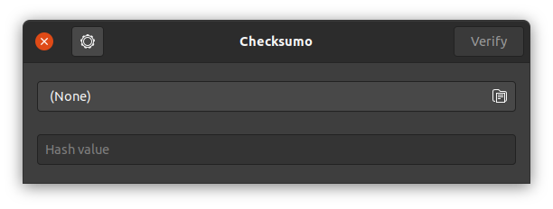
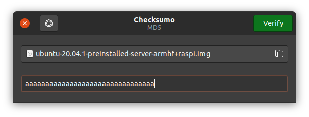
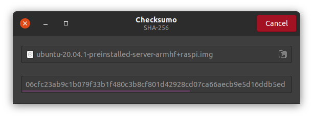
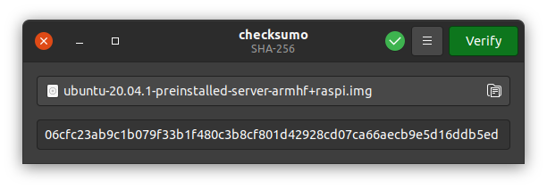

# checksumo 

<a href='https://flathub.org/apps/details/com.github.dawidd6.checksumo'></a>

A simple application for verifying specified file against given hash, written in Go with GTK+3 graphical interface.

Automatically detects the following hash types:
- SHA-256
- SHA-512
- MD5

Supports cancellation of verification if desired.

## Gallery









## Installation

### Flatpak

Click the Flathub badge above for more informations.

### Source

To build and run this software, one needs to have:

- **GTK** `>=3.22`
- **Go** `>=1.11`

then execute below commands:

```shell script
$ make
$ sudo make install
```
