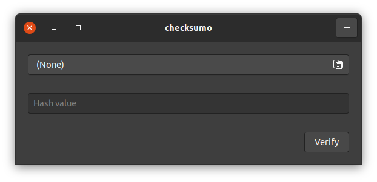
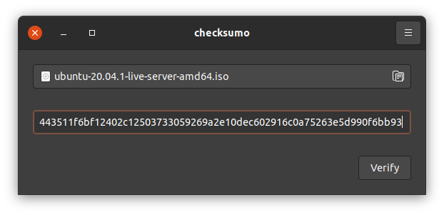
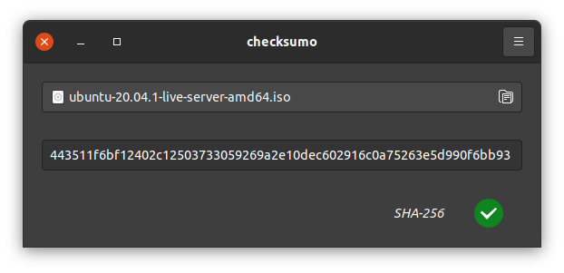

# checksumo 


A simple application for verifying specified file against given hash, written in Go with GTK+3 graphical interface.

## Hashes

Automatically detects the following hash types:
- SHA-256
- SHA-512
- MD5

## Gallery







## Installing

This application targets Ubuntu 18.04 and later, though the only requirement is to have GTK+ 3.22 or later installed.

### Binary

Head over to Releases section of this repository, grab the `.deb` file and install it via `dpkg`.

### Source

Needs `libgtk-3-dev` package on Debian-based distributions.

```shell script
make
make install
```