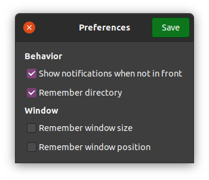

<h1>Checksumo</h1>

<a href='https://flathub.org/apps/details/com.github.dawidd6.checksumo'></a>

A simple application for verifying specified file against given hash, written in Go with GTK+3 graphical interface.

Automatically detects the following hash types:
- SHA-256
- SHA-512
- MD5

Supports cancellation of verification if desired.

## Gallery




## Installation

### Flatpak

Click the Flathub badge above for more information.

### Source

To build and run this software, one needs to have:

- **GTK** `>=3.24`
- **Go** `>=1.11`
- **Meson** `>=0.48`

then execute below commands:

```shell script
meson build
sudo meson install -C build
```
